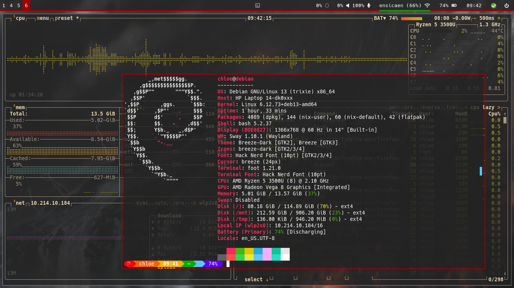

# swayconfig
dotfiles for my sway configuration


## pics



## needed packages

```
light
HackNerdFonts
foot
sway
flameshot
pavucontrol
```

## needed config commands

```
flameshot config --maincolor \#a40000
```
